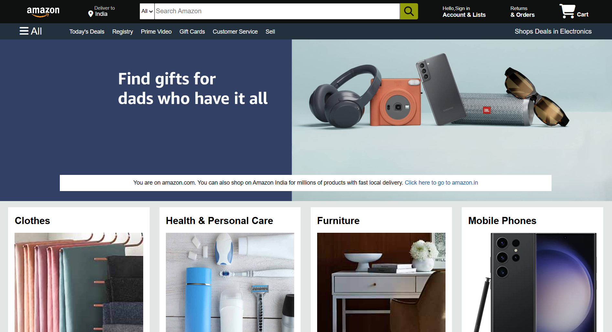
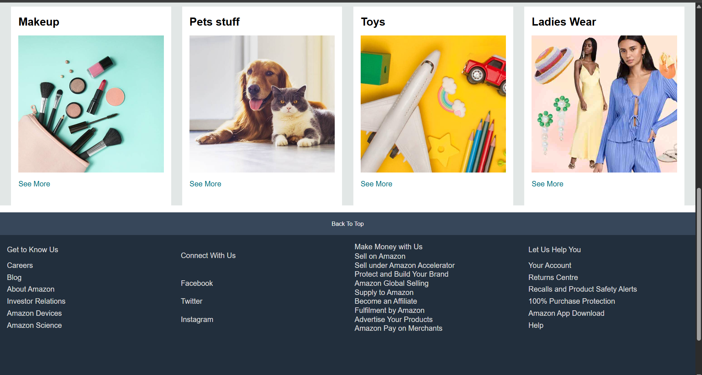

# Amazon clone(frontend only)
This is a basic front-end clone of the Amazon homepage, created using HTML and CSS. The goal of this project was to practice web layout and styling.

⚠ Note: This is a static project — buttons and links are non-functional, as JavaScript functionality has not been added yet.

🔍 Features~
- Header with search bar and cart icon.
- Product category sections.
- Grid-based product layout.
- Footer similar to original Amazon site.

🛠 Technologies Used~
- HTML  
- CSS

🎯 Future Improvements~
- Add JavaScript to make buttons and links interactive.
- Add product filtering and searching.
- Improve responsiveness for smaller devices.

📸 Screenshot

📁 How to Use~
Just open the index.html file in your browser to view the site.

# This project is for educational purposes only and is not affiliated with Amazon in any way.

